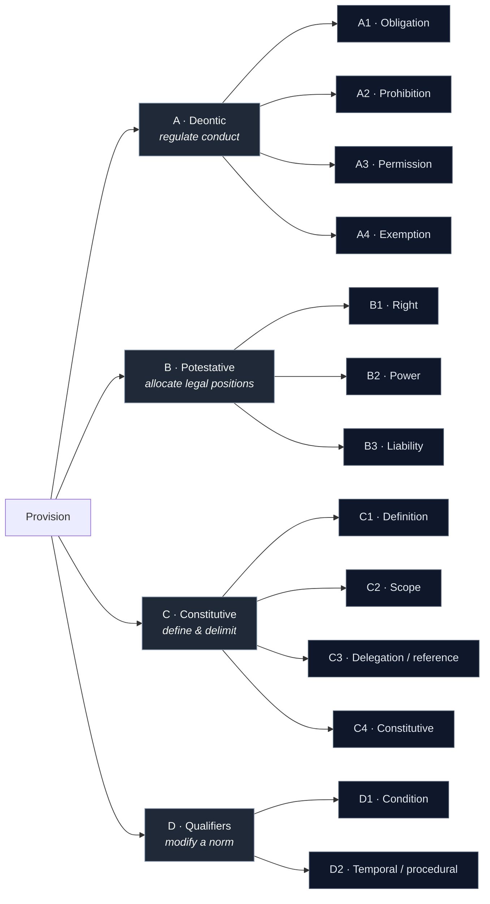

# Legal-norm taxonomy — the label space

A draft classification of what a regulatory provision *does*. Each top-level
group answers a different question; the leaf codes (`A1`, `B2`, …) are the
candidate label values for the classifier. Provisions are often **multi-label** —
especially the `D` qualifiers, which modify a norm rather than stand alone.

## A. Deontic modalities

*Regulate conduct.*

| Code | Label | Lexical cues |
|------|-------|--------------|
| **A1** | Obligation / duty | "shall," "must," "is required to" |
| **A2** | Prohibition | "shall not," "may not," "is prohibited" |
| **A3** | Permission | "may," "is permitted," "is allowed" |
| **A4** | Exemption / derogation / exception | "shall not apply," "by way of derogation," "does not apply where" |

## B. Potestative modalities

*Allocate legal positions / capacity.*

| Code | Label | Lexical cues |
|------|-------|--------------|
| **B1** | Right / entitlement | "shall have the right to," "is entitled to" |
| **B2** | Power / competence | "shall be empowered to," "may adopt," "shall designate" |
| **B3** | Liability / sanction | "shall be subject to fines," "penalties… effective, proportionate and dissuasive" |

## C. Constitutive / non-normative provisions

*Define and delimit — they don't command.*

| Code | Label | Lexical cues |
|------|-------|--------------|
| **C1** | Definition | "means," "refers to," "for the purposes of this Regulation" |
| **C2** | Scope / application | "this Regulation applies to," "shall not apply to" |
| **C3** | Delegation / reference | cross-refs to other articles or to Member State law |
| **C4** | Constitutive (establishes a legal state) | "shall be deemed," "shall be treated as," "shall be considered as," "shall remain" |

## D. Qualifiers

*Modify a norm rather than stand alone — typically multi-label.*

| Code | Label | Lexical cues |
|------|-------|--------------|
| **D1** | Condition | "where," "provided that," "subject to," "unless" |
| **D2** | Temporal / procedural requirement | deadlines, sequencing ("within 72 hours") |
