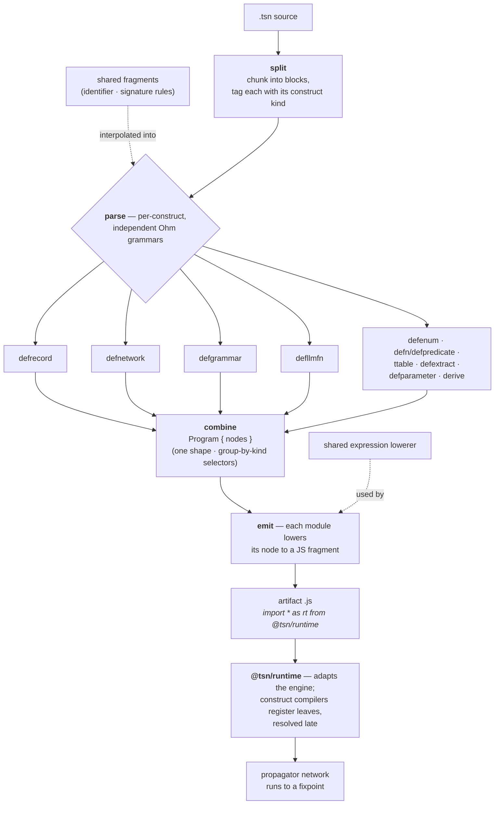

# Milestone — Modular language architecture

## Context

The language front end was originally built on **Lezer**. A single grammar produced a
concrete syntax tree, which a hand-written code generator (`jsgen`) walked with a manual
**cursor** to emit JavaScript. One grammar, one tree-walker, tightly coupled: the whole
front end in one piece.

## The problem

That shape did not scale or read well:

- **The cursor.** Lowering meant driving a cursor over the Lezer tree by hand — advance,
  descend, check node type, back out. Position-sensitive, easy to get subtly wrong, and
  hard to follow when reading the code months later.
- **Writing Lezer rules was tricky.** The grammar was finicky to author and to extend.
- **A complicated, poorly functional pipeline.** One monolithic grammar plus a
  cursor-walking generator meant the stages were entangled: adding or changing a construct
  rippled through several places, and parallel representations of the same shape drifted
  apart. It was imperative where it wanted to be functional.

## Proposed solution

A deliberately **non-conventional architecture**: instead of one grammar and a cursor,
a family of small, **independent, cooperative per-construct grammars** (Ohm).

Each construct owns its own grammar, parser, and emitter as a self-contained module. A
thin **splitter** chunks source into construct-tagged blocks (next-anchor, blob-aware), so
each block is parsed by its own grammar **in isolation** — the per-construct grammars never
have to compose with one another. A **combine** step assembles the parsed nodes into one
`Program`; each module then **emits** its node to a JS fragment against a small, frozen
runtime surface.

The grammars are *independent* (each parses its own block) yet *cooperative*: they share a
single set of grammar fragments (the declaration-name and function-signature rules) and a
single expression lowerer. The result is a pipeline that is functional and pull-apart-able
where the old one was monolithic and imperative.

## The path

We worked **stream by stream** on a long-lived feature branch, each stream a small loop:
plan (proposing alternatives where the road forked) → implement test-first → assess →
commit → update the PR ledger → next. Green at every commit (CJS + ESM + typecheck). Over
these streams we migrated every construct, retired Lezer **and** `jsgen`, and converged on
**one** emit path and **one** `Program` shape end to end. We then went further and enforced
**single source of truth**: the parallel engine `*AST` family and the runtime `Spec` family
were eliminated, `as unknown as` casts at the boundary replaced by a compile-time contract,
and the record/enum nodes derived from their descriptors rather than re-listing them.

That last phase is **why Grudge was necessary**. As the work deepened, the real risk was no
longer broken behavior — the tests stayed green — it was **drift on non-measurable criteria**:
a duplicated shape kept in sync by a cast, a comment describing a deleted type, a test that
looked thorough but asserted nothing load-bearing. The implementer-in-flow, carrying the
accumulated context of the change, consistently missed these; they surfaced only when a
**fresh-context** reviewer looked. So we formalized that exogenous point of view as
**Grudge** — a read-only, advisory, ledger-aware, metric-grounded principles auditor,
invoked at the end of a stream. Context management is the binding constraint for an agent as
much as for a human; Grudge is the external check that keeps the work honest without a person
reading every line. Fittingly, its first audit caught two real stale comments and exposed
that the principles it checks against were not actually codified in `CLAUDE.md` — which led
to the **Design principles** section now standing as the law.

## Achievement

A modular, per-construct **Ohm** front end has fully replaced the Lezer/`jsgen` pipeline:

- **Ten cooperating construct modules** — `defrecord`, `defenum`, `defn`/`defpredicate`,
  `defgrammar`, `ttable`, `defextract`, `defnetwork`, `defllmfn`, `defparameter`, `derive` —
  Lezer and the cursor-walking `jsgen` **removed**; **one** emit path, **one** `Program` shape.
- **Single source of truth enforced at compile time**: no parallel type families, no
  `as unknown as` casts at the runtime boundary; nodes derive from their descriptors and the
  runtime is type-checked against an explicit construct contract.
- **Compile-once, run-anywhere artifacts**: a `.tsn` program emits a self-contained `.js`
  that runs against `@tsn/runtime` under plain `node`.
- **Maintenance instruments born from the work**: the **Grudge** auditor agent, the codified
  **Design principles**, and the analysis tool (currently **20 modules · 7,306 src LOC · 0
  cycles**).

The front end is layered acyclically — `core ← constructs ← pipeline`, with `runtime/`
above — so a construct is now a self-contained module added in one place, not a change
threaded through a monolith.
